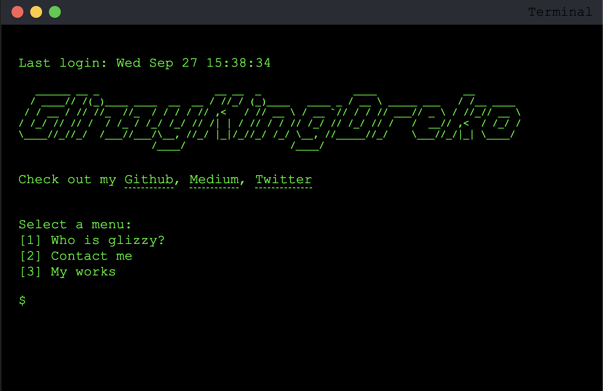

# My simple macOS Terminal portfolio

Welcome to the open-source repository of my portfolio! This web page is designed to replicate the look and feel of a macOS terminal, offering visitors an interactive and engaging way to learn more about me.

Check it out on [Codepen](https://codepen.io/glizzykingdreko/pen/gOZzBbP) or [GitHub Pages](https://glizzykingdreko.github.io/).

 

## Overview

The portfolio provides a brief introduction to me, a bit about my journey and expertise in the tech world. It showcases some of the projects I've worked on and offers various ways to get in touch.
Is just a quick and simple way to get to know me, a simple portfolio I've designed in an hour.

### Features

- **Interactive Terminal Interface:** Navigate through the contents using either keyboard input or by clicking on the available options.
- **About Section:** Learn about my journey in the tech world, from my early days of providing Minecraft mods to my current expertise in bypassing antibots and ticket reselling.
- **Projects:** A curated list of some of my projects with direct links to their GitHub repositories or other relevant platforms.
- **Contact:** Find out how to reach me via email or Discord.